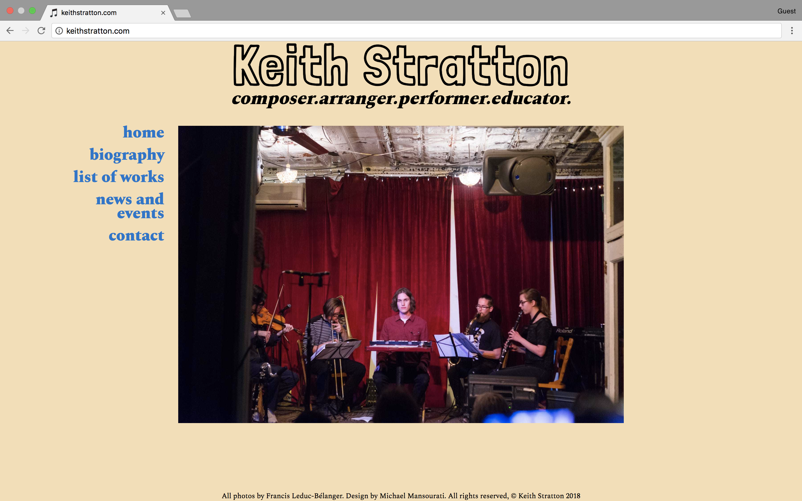
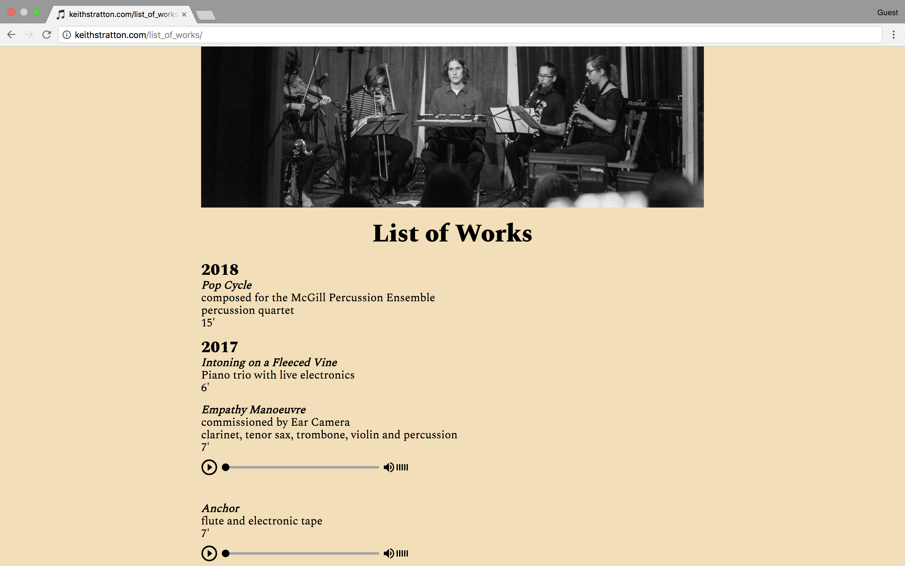

# [keithstratton.com](http://www.keithstratton.com)
keithstratton.com is a portfolio site built for a musician and friend of mine, Keith Stratton. I used the GatsbyJS static site generator, which is built on ReactJS. One of the features of the site is a React component I built that acts a wrapper for the HTML5 web audio API. It is a customized and extended version of the component in [this tutorial](http://nael.io/2017-03-11-building-a-react-audio-player/).

## Preview

